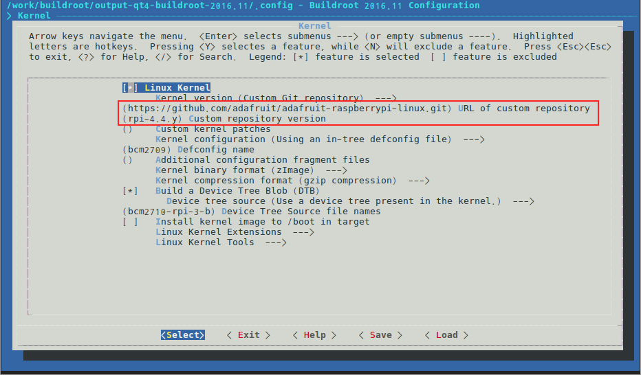

## 첫번째 시도

기존의 시스템과 무관하게 단순하게 작업을 하여 동작하는지 확인을 한다.

### 1. Buildroot 준비

[2016.11 버전](https://buildroot.org/downloads/buildroot-2016.11.tar.gz)을 사용한다.

```bash
tar xzf buildroot-2016.11.tar.gz
cd buildroot-2016.11
make O=../output-buildroot raspberrypi3_defconfig
```

### 2. Adafruit kernel 적용

LCD를 활성화하기 위해서 [Adafruit github](https://github.com/adafruit/adafruit-raspberrypi-linux)를 사용한다.

```bash
make O=../output-buildroot menuconfig
```

아래 그림과 같이 buildroot의 kernel 설정을 수정한다.



### 3. post-build.sh 수정

- board/raspberrypi3/post-build.sh를 아래와 같이 수정한다.

  ```bash
  #!/bin/sh

  set -u
  set -e

  ## Add a console on tty1
  #if [ -e ${TARGET_DIR}/etc/inittab ]; then
  #    grep -qE '^tty1::' ${TARGET_DIR}/etc/inittab || \
  #        sed -i '/GENERIC_SERIAL/a\
  #tty1::respawn:/sbin/getty -L  tty1 0 vt100 # HDMI console' ${TARGET_DIR}/etc/inittab
  #fi
  ```

### 4. Buildroot 빌드

```bash
make O=../output-buildroot
```

빌드가 완료되면 `output-buildroot/sdcard.img`가 생성된다. 이 파일을  `dd` 혹은 `Win32ImageWriter` 어플리케이션을 사용하여 마이크로 SD에 복사한다.

### 5. 부팅 파일 수정

마이크로 SD 카드를 마운트하여 boot영역 (fat 파티션)에 있는 config.txt와 cmdline.txt를 수정해야 한다.

- config.txt에 아래 내용을 추가한다.

  ```ini
  [pi1]
  device_tree=bcm2708-rpi-b-plus.dtb
  [pi2]
  device_tree=bcm2709-rpi-2-b.dtb
  [all]
  dtparam=spi=on
  dtparam=i2c1=on
  dtparam=i2c_arm=on
  dtoverlay=pitft28-resistive,rotate=90,speed=32000000,fps=20
  ```

- cmdline.txt를 아래와 같이 수정한다.

  ```
  dwc_otg.lpm_enable=0 console=tty1 root=/dev/mmcblk0p2 rootfstype=ext4 elevator=deadline fsck.repair=yes rootwait fbcon=map:10 fbcon=font:VGA8x8
  ```

### 6. 테스트

준비된 마이크로 SD 카드를 라즈베리 파이에 장착하고 부팅하여 콘솔 메시지가 LCD에 출력되는지 확인한다.